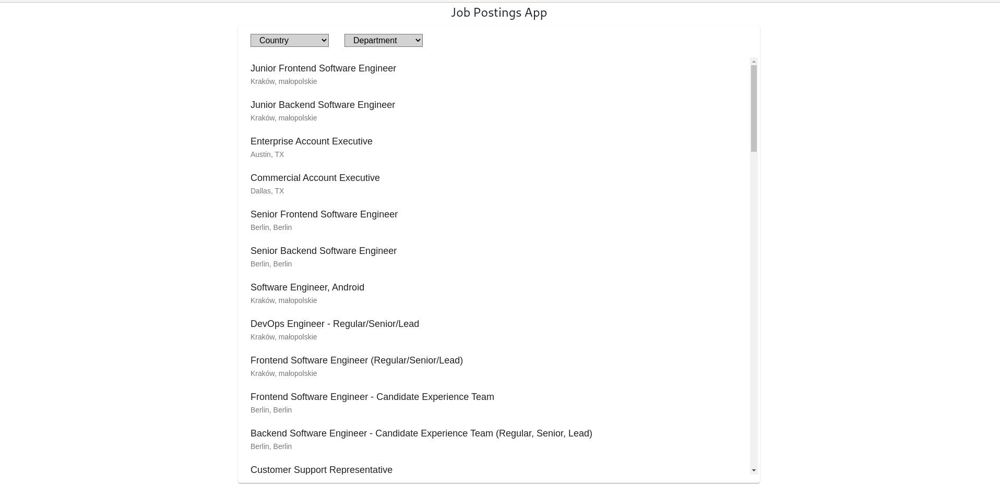
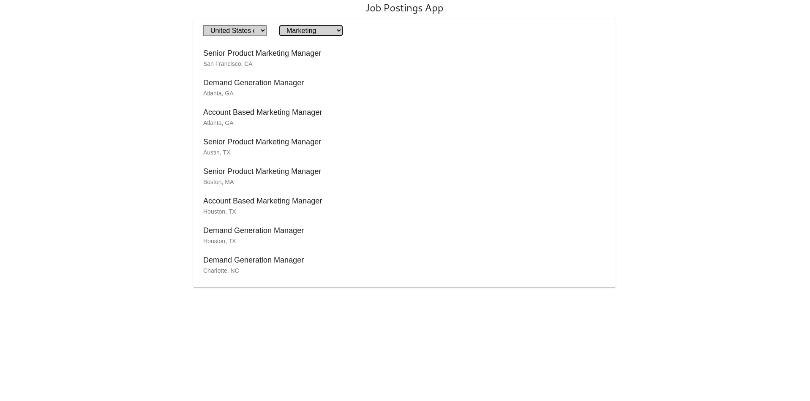
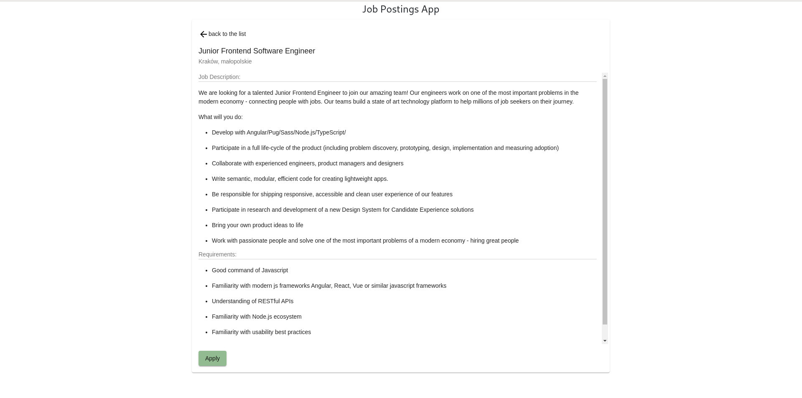

# Job Posting

Run 'npm install' to install all packages.

## Development server

Run `npm run start` for a dev server. Navigate to `http://localhost:8080/`. The app will automatically reload if you change any of the source files.

## Build

Run `npm run build` to build the project. The build artifacts will be stored in the `dist/` directory. Use the `--prod` flag for a production build.

## Running end-to-end tests

Run `npm run e2e` to execute the end-to-end tests
Run `npm run e2e:chromium` to execute the end-to-end tests with chromium browser

## ScreenShots:

## Cypress test video

path-> (cypress/ video/Test-video.mkv)

    Test scenario:
    1. Check the posting
    2. Test the api's call
    3. Filtering the list by country and department
    4. Check the description page and consistency
